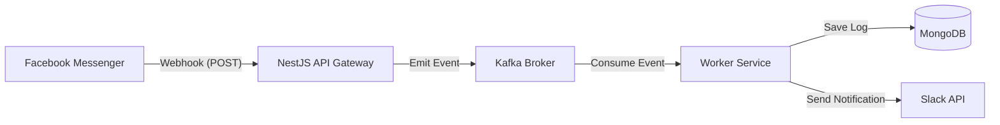

# Slack-Facebook Integration

## Description
A scalable, production-ready integration service that bridges Facebook Messenger and Slack. Built with **NestJS**, this application leverages **Kafka** for asynchronous event processing and **MongoDB** for persistent logging, ensuring high availability and reliability. It is designed to handle Facebook webhook events, process them via a microservices architecture, and deliver formatted notifications to a specified Slack channel.

## Prerequisites
Ensure you have the following installed on your system:
- **Node.js** (v18 or later)
- **Docker** & **Docker Compose**
  - **Zookeeper**: `confluentinc/cp-zookeeper:7.4.0`
  - **Kafka**: `confluentinc/cp-kafka:7.4.0` (exposed on 9093)
- **ngrok** (for exposing your local server to Facebook)

## Setup Instructions

1.  **Clone the Repository**
    ```bash
    git clone <repository-url>
    cd slack-facebook-integration
    ```

2.  **Environment Configuration**
    Copy the example environment file and configure your credentials:
    ```bash
    cp .env.example .env
    ```
    Open `.env` and fill in the following:
    - `FACEBOOK_APP_SECRET`: Your Facebook App Secret.
    - `FACEBOOK_VERIFY_TOKEN`: A custom string for webhook verification.
    - `SLACK_BOT_TOKEN`: Your Slack Bot User OAuth Token (`xoxb-...`).
    - `SLACK_CHANNEL_ID`: The Channel ID where notifications should be sent.

3.  **Start Infrastructure**
    Spin up Zookeeper, Kafka, and MongoDB using Docker Compose:
    ```bash
    docker compose up -d
    ```

4.  **Install Dependencies & Start Application**
    ```bash
    npm install
    npm run start:dev
    ```

5.  **Expose Local Server**
    Use ngrok to expose port 3000 to the internet:
    ```bash
    ngrok http 3000
    ```
    Copy the HTTPS URL provided by ngrok (e.g., `https://abcd-123.ngrok.io`).

## Facebook & Slack Configuration

### Facebook App
- Go to the **Meta for Developers** portal.
- Add the **Messenger** product to your app.
- In **Webhooks** settings:
  - **Callback URL**: `<YOUR_NGROK_URL>/webhook`
  - **Verify Token**: The value you set for `FACEBOOK_VERIFY_TOKEN` in `.env`.
- Subscribe to `messages` events.

### Slack App
- Go to **api.slack.com** and create an app.
- Enable **Incoming Webhooks** or **Bots** permissions (`chat:write`).
- Install the app to your workspace.
- Copy the **Bot User OAuth Token** to your `.env`.
- Add the bot to the target channel.

## Architecture Diagram



**Flow Description:**
1.  **Facebook** sends a webhook event (message) to the NestJS API.
2.  **FacebookModule** validates the request signature (HMAC-SHA256) and emits the payload to a **Kafka** topic (`fb-messages`).
3.  **WorkerModule** consumes the message from Kafka asynchronously.
4.  The worker logs the event to **MongoDB** for audit trails.
5.  The worker formats the message using **Slack Block Kit** and sends it to the configured **Slack** channel.

## Evaluation Criteria Met

### 1. Functionality
- **Complete Integration**: Successfully receives Facebook messages and forwards them to Slack.
- **Security**: Implements critical `X-Hub-Signature-256` validation to ensure request integrity.
- **Validation**: Uses DTOs and Joi to validate incoming payloads and environment variables.

### 2. Scalability
- **Event-Driven Architecture**: Decouples the webhook receiver (Producer) from the processor (Consumer) using **Kafka**. This allows the system to handle high throughput without blocking the HTTP response to Facebook.
- **Microservices Ready**: Configured as a Hybrid Application, ready to be split into separate deployable units.

### 3. Code Quality
- **Modular Design**: Separated concerns into `FacebookModule`, `WorkerModule`, and `SlackModule`.
- **Type Safety**: Strict TypeScript usage with Interfaces and DTOs.
- **Logging**: Structured JSON logging with `nestjs-pino` and correlation IDs for observability.

### 4. Testing
- **Unit Tests**: Comprehensive Jest tests for Controllers and Services.
- **Coverage**: Includes tests for webhook verification, signature validation logic, and event processing.

## Collaborator
> **Note:** Please add 'dev-highlevel' as a collaborator to the repository.
